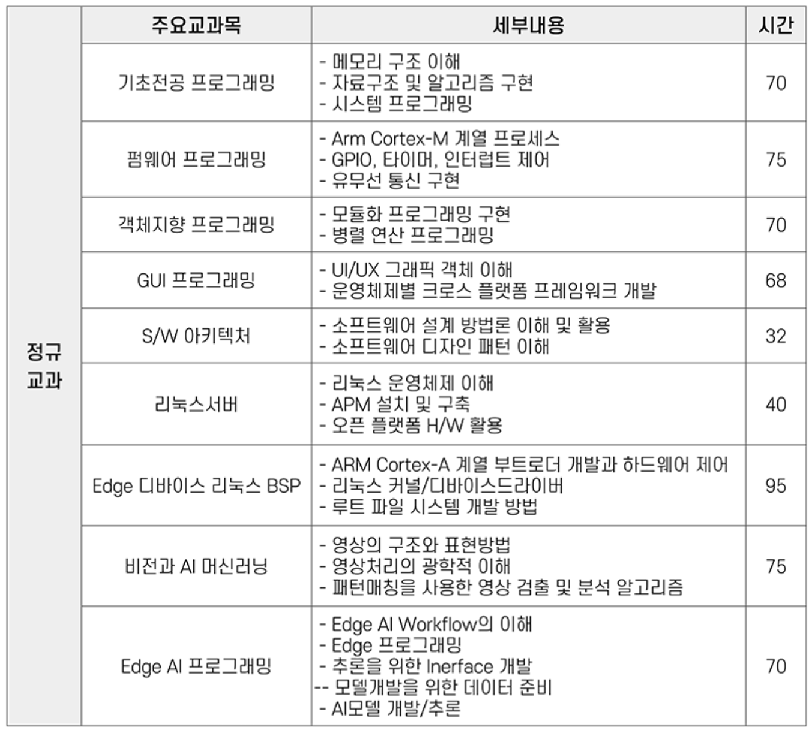
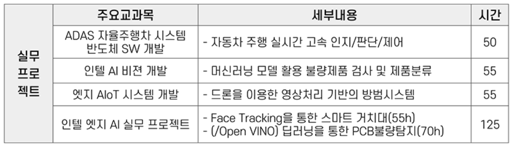
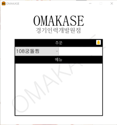

<div align="center">

　
## 🙏 INTRO
안녕하세요!  
INTEL Edge AI SW (900H) 프로젝트 과정을 깃허브에 기록하였습니다.  


　
## ⚙ Skills
      


　
## 🛠 IDE
    


　  
 ## 📅 Schedule
 


　 
## 💼 Projects
> #### 1. 스마트 IOT 주차장
> ```
> 설 명 : ATmega128A를 이용한 주차장 설계  
> 역 할 : 팀원　　　　　　　　　　　　　　  
> 기 간 : 2023. 11. 20 ~ 2023. 11. 28　　  
> 기 술 : C, HTML, PHP, SQL　　
> ```
>      
>
>  
>    
>
>
> <a href="https://github.com/mylittlebluebird/iot_parking_system/"></a>
>  


　 
> #### 2. 북쪽지뢰찾기
> 설 명 : Windows 지뢰찾기 클론 코딩  
> 역 할 : `팀장`    
> 기 간 : 2023. 12. 25 ~ 2023. 12. 29  
> 기 술 : C#, SQL    
>      
>
>>  
>>    
>
>
> <a href="https://github.com/mylittlebluebird/iot_parking_system/"></a>
> 


　
> #### 3. 오마카세
> 설 명 : 네이버 지도 파주운정지역 리뷰 기반 맛집 키워드 검색 시스템   
> 역 할 : `팀장`   
> 기 간 : 2024. 02. 12 ~ 2024. 02. 22  
> 기 술 : Python, Selenium, Natural Language Processing  
>      
>
>>  
>>    
>
>
> <a href="https://github.com/mylittlebluebird/omakase"></a>
> 


　
　  
> #### 4. 강성노조
> 설 명 : ADAS 자율주행 SW RC카 설계  
> 역 할 : `소프트웨어 팀장`   
> 기 간 : 2024. 02. 26 ~ 2024. 03. 08  
> 기 술 : C, RTOS, STM32, UltraSonic  
>      
>
>>  
>>    
>
>
> <a href="https://github.com/mylittlebluebird/iot_parking_system/"></a>
> 


　  

## 📃 Side Projects
> #### 1. 실종아동 성인 얼굴인식 모델 설계 (진행중)
> 설명 : 실종 당시 사진으로 GAN모델을 이용하여 현재 외모 예상 후 CCTV 얼굴 인식    
> 역할 :    
> 기간 : 2024. 02. ~  
> 사용언어 : Python
>   
> <a href="https://github.com/shinht97/foot_print_project"></a>    
>


　
> #### 2. K-해커톤 (설계중)
> 설명 :   
> 역할 :    
> 기간 : 2024. 03. ~  
> 사용언어 : Python   
> [Repositorie](https://github.com/mylittlebluebird/omakase/)  
>


　
## 📞 Contact
#### 📧 Email : while@kakao.com  
#### 🖥 Blog : <a href="https://github.com/shinht97/foot_print_project"></a>  

</div>
　
